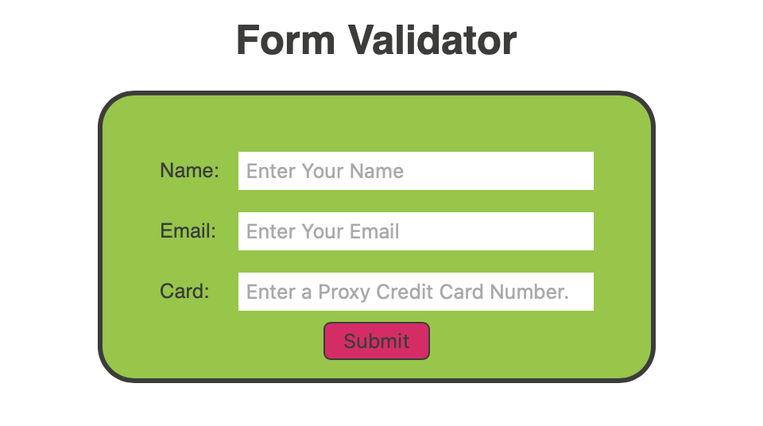

# Form Validator
## Overview

A form used to validate a Name, Email address and Card number of a user.  

When pressing Submit, if all the informations provided pass the validation check, the default Desktop email Client is triggered, creating an email using the data provided in the form.
